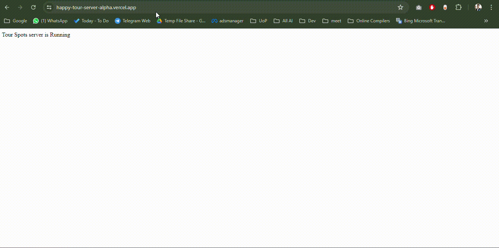

<h1 align="center">Happy Tour Server </h1>


<p align="center">
  
</p>
<br>

## Live Server:
[Happy-Tour-Server](https://happy-tour-server-alpha.vercel.app/)

Client Repo Link: [HR-Hub-Pro-Client](https://github.com/younusFoysal/HR-Hub-Pro-Client)


## Project Overview


## Features


## Technologies Used
```
node
cors
dotenv
express
mongodb
```

## How to Run Locally
1. Clone the repository: `git clone https://github.com/younusFoysal/Happy-Tour-Server.git`
2. Navigate to the project directory: `cd Happy-Tour-Server`
3. Install dependencies: `npm install`
4. Set up environment variables as per `.env`.
5. Start the server: `nodemon index.js`
